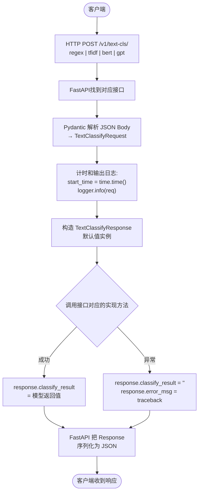
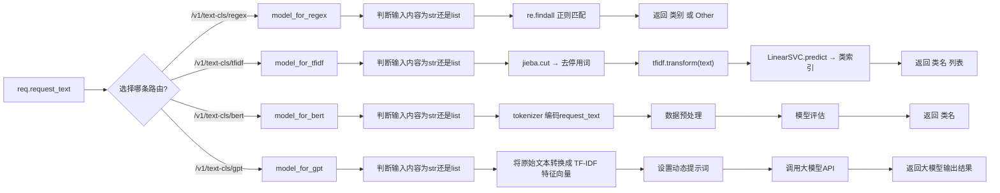

## 1. 各源文件作用
```bash
01-intent-classify/
├── main.py              ← FastAPI 入口,定义 4 个意图分类接口
├── config.py            ← 全局配置(规则 / 模型路径 / LLM 信息)
├── data_schema.py       ← Pydantic 定义数据指定格式(请求/响应)
├── logger.py            ← 日志初始化(控制台 + 文件)
├── model/               ← 各分类算法的推理封装
│   ├── regex_rule.py    ← 正则规则匹配
│   ├── tfidf_ml.py      ← TFIDF + LinearSVC 加载与推理
│   ├── bert.py          ← BERT 模型加载与推理
│   └── prompt.py        ← 大模型(Qwen-plus) + Few-shot
└── training_code/       ← 模型训练脚本
    ├── train_tfidf.py   ← 训练 TFIDF + SVM
    └── train_bert.py    ← 微调 BERT 中文分类模型
```

## 2. FastAPI 请求到响应的全流程

### 2.1 主链路流程图



### 2.2 四个分类后端的差异化分支

