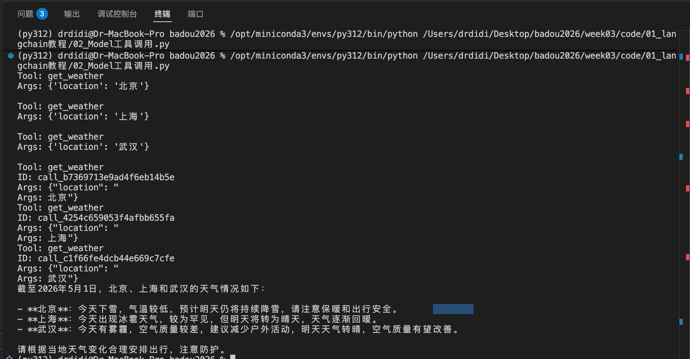

作业1: 安装langchain 和 openai-agent，运行 langchain / 02_Model工具调用.py
回答如下问题：
1、 langchain 工具调用 和 llm function call 有什么区别？
2、 langchain 工具调用 的 速度是受到什么影响？

---

langchain/02_Model工具调用.py 运行结果：

---

问题一：langchain 工具调用 和 llm function call 有什么区别？
答：
- llm 的 function call 是模型的一种结构化输出的能力，方便开发者对这种结构化的输出做处理，通过对这个结构化的输出进行处理，实现函数调用，然后将调用结果返回给 llm
- langchain 的工具调用是对 llm functino call 能力的封装，让开发者方便、快捷的利用 llm 的 function call 能力

问题二：langchain 工具调用 的 速度是受到什么影响？
langchain 工具调用的开销一定是大于原生手写实现 llm function call，主要影响：
- 框架开销，langchain 是一个通用框架，为了通用性，内部存在大量的判断、转换处理，这些是原生实现不存在的
